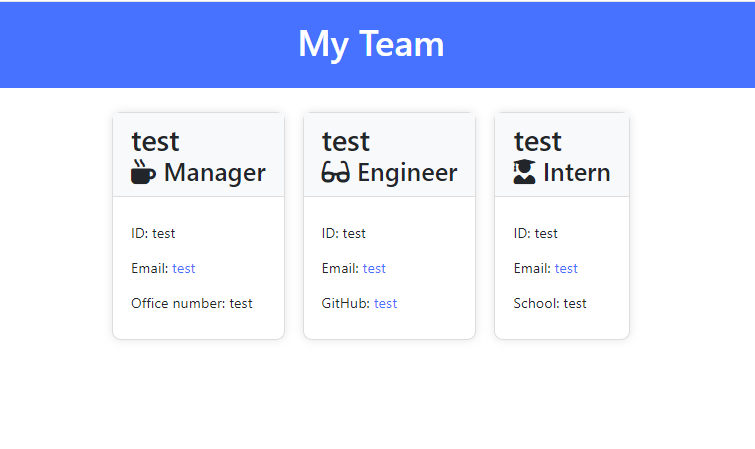

# Team Profile Generator

## Description

Welcome to the Team Profile Generator README.

The Team Profile Generator is a command-line application designed for crafting a webpage showcasing your development team. It allows you to add details for each team member, including Managers, Engineers, and Interns. The application then generates an HTML page displaying your team's structure along with each member's vital information.

## Table of Contents

* [Description](#description)
* [Installation](#installation)
* [Usage](#usage)
* [Tests](#tests)

## Installation

To install the Team Profile Generator:

1. Clone the repository: `git clone git@github.com:ParboldCoder/team_profile_generator.git`.
2. Navigate to the repository: `cd your-repo`.
3. Install the dependencies: `npm install`.
4. Run the application: `node index.js`.

## Usage

To use the Team Profile Generator:

* Adding a Manager: Begin by running `node index.js` and provide details for the Manager when prompted.
* Adding a Engineer: Choose "Add an Engineer" from the menu and provide the Engineer's details - name, ID, email, and GitHub username.
* Adding a Intern: Choose "Add an Intern" from the menu and provide the Intern's details - name, ID, email, and current school.
* Finish Building the Team: Select "Finish building the team" when you are satisfied with the team composition. The application will generate an HTML file displaying your team's profile.

Please ensure you have [Node.js](https://nodejs.org/dist/v20.11.1/node-v20.11.1-x64.msi) and npm installed before running the application.

## Tests

To run tests for the Team Profile Generator:

1. Install dependencies: `npm install`.
2. Navigate to the project directory: `cd TeamProfileGen`.
3. Run the tests: `npm test`.

Ensure all tests pass without errors. Review the test logs for any issues and address them accordingly.
